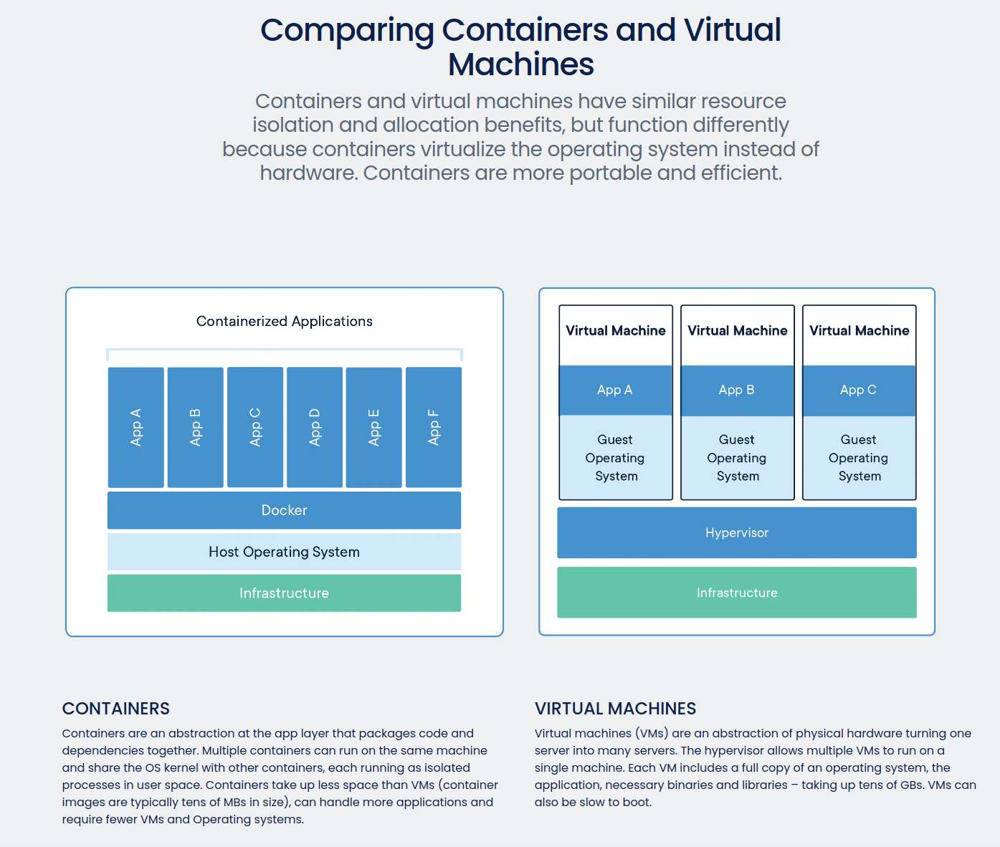

- [Introduction to developing with Docker and VS Code](#introduction-to-developing-with-docker-and-vs-code)
    - [Why Docker](#why-docker)
    - [Docker vs virtual machines](#docker-vs-virtual-machines)
    - [Visual Studio Code Remote Development](#visual-studio-code-remote-development)
    - [Visual Studio Code First Time Setup on Local PC](#visual-studio-code-first-time-setup-on-local-pc)
      - [Required extensions for VS Code](#required-extensions-for-vs-code)
      - [Connect to LIMO and start container](#connect-to-limo-and-start-container)
    - [References](#references)

<div class="page"/>

# Introduction to developing with Docker and VS Code

You can watch a live demo of the [Visual Studio Code Remote - Containers](https://www.youtube.com/watch?v=TVcoGLL6Smo) on YouTube.

### Why Docker

[Docker](https://docs.docker.com/get-started/overview/) provides OS-level virtualisation, allowing for the deployment of software packages in isolated environments called containers. 


<center><em>Images are prepacked beforehand and become containers when run on Docker Engine</em></center>

<div class="page"/>

### Docker vs virtual machines

Docker and virtual machines provide similar benefits, however, they are functionally different. 



<div class="page"/>

### Visual Studio Code Remote Development

The Visual Studio Code [Dev Containers extension](https://code.visualstudio.com/docs/remote/containers) allows you to use a Docker container as a developmen environment. 


The development workspace folder can be mounted from the local file system in the container. Extensions can be installed and run inside the containers, similarly to the local environment. 

The [devcontainer.json](../.devcontainer/devcontainer.json) file tells VS Code how to access or create the development container with the needed tools. 

<div class="page"/>

### Visual Studio Code First Time Setup on Local PC

#### [Required extensions for VS Code](https://code.visualstudio.com/docs/editor/extension-marketplace)
* Remote Development
```bash
code  --install-extension ms-vscode-remote.vscode-remote-extensionpack
```

#### Connect to LIMO and start container

1. SSH into the LIMO using VS Code
    * In VS Code, Ctrl + Shift + P to bring up the command pallete
    * (Do once if static IP assigned) Search for "Remote-SSH: Add new SSH Host..."
    * ssh agilex@<limo_IP>
    * Bring up command pallete again, search for "Remote-SSH: Connect to Host..."
    * Once connected, "File" -> "Open Folder" and navigate to limo_ros2 workspace

2. Run docker image
    * Once in the workspace, VS Code should detect the Dockerfile and ask to build container
    * Alternatively, Ctrl + Shift + P to bring up the command pallete and search for Remote-Containers: Rebuild Container

### References
1. [VS Code Remote Development](https://code.visualstudio.com/docs/remote/remote-overview)
2. [Useful template for reference](https://github.com/athackst/vscode_ros2_workspace)